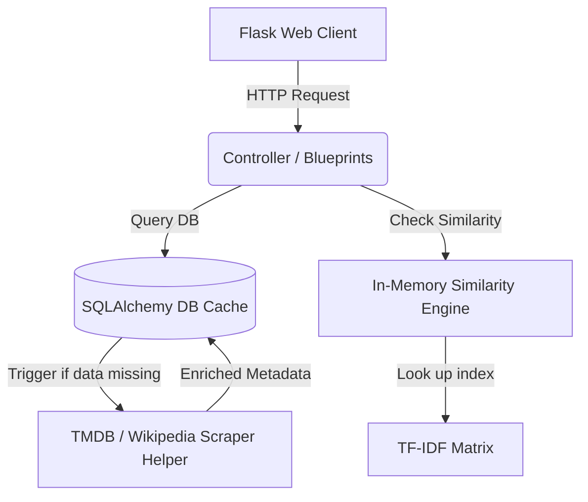

# 🎬 Cinema-Scale

<p align="center">
  
  
  
  
  
</p>

---

## 🌟 Project Overview

**Cinema-Scale** is an interactive, full-stack movie browsing and content-based recommendation platform. It combines a Python/Flask-based web application with machine learning algorithms to suggest films that share metadata similarity with users' favorite titles.

The application dynamically enriches basic movie details with deep production metadata and posters on-the-fly, pulling directly from **The Movie Database (TMDB) API** and **Wikipedia's upload CDN**. 

---

## 🚀 Key Features

### 🧠 Content-Based Recommendation Engine
- **TF-IDF Vectorization & Cosine Similarity**: Compares movie genres, tags, plot keywords, cast, and directors to generate a similarity score matrix.
- **Robust Typo Matching**: Features integrated `difflib` support to handle user search typos gracefully.
- **Eager Initialization**: Trains the dataset on server startup to maintain $O(1)$ response times for similarity lookups during client requests.

### 🔌 Live Metadata Enrichment & Fallback
- **TMDB Integration**: Seamlessly downloads film summaries, runtimes, budgets, revenues, popularity metrics, and official posters.
- **Wikipedia Media API Fallback**: Autonomously crawls Wikipedia's Media CDN to fetch film posters when TMDB API keys are restricted or throttled.

### 👥 Interactive User Experience
- **Authentication**: Secure registration, login, and administrative role handling.
- **Personalization**: User specific custom watchlists (saved movies), and interactive like toggles.
- **Reviews & Ratings**: Fully integrated user rating system (1-10 scale) and comment section.
- **Sleek Interface**: Styled with custom, interactive, modern glassmorphic designs, carousels, responsive grids, and subtle hover animations.

### 🛡️ Administrative Dashboard
- Admins can delete users, delete movies, manually add entries, and monitor project telemetry (overall counts of movies, users, and user reviews).

---

## 🛠️ Tech Stack & Libraries

| Category | Technology |
| :--- | :--- |
| **Backend Framework** | [Flask](https://flask.palletsprojects.com/) (Python) |
| **ORM & Database** | [Flask-SQLAlchemy](https://flask-sqlalchemy.palletsprojects.com/) / [SQLite](https://sqlite.org/) or [PostgreSQL](https://www.postgresql.org/) |
| **Machine Learning** | [Scikit-learn](https://scikit-learn.org/) (`TfidfVectorizer`, `cosine_similarity`), [Pandas](https://pandas.pydata.org/), [NumPy](https://numpy.org/) |
| **Fuzzy Matching** | [difflib](https://docs.python.org/3/library/difflib.html) (Python Standard Library) |
| **Web UI** | HTML5, Vanilla CSS3 (Custom Glassmorphism), JavaScript (AJAX & pagination) |
| **Metadata API** | [TMDB API](https://www.themoviedb.org/documentation/api) & [Wikipedia API](https://www.mediawiki.org/wiki/API:Main_page) |

---

## 🏗️ Architecture



For a detailed walkthrough of the implementation details, see [walkthrough.md](file:///c:/Users/nikhi/OneDrive/Desktop/Group%20Pro/Cinema-Scale/walkthrough.md).

---

## 💻 Installation & Local Setup

### Prerequisites
- Python 3.8 or higher installed on your machine.
- Git client.

### Step-by-Step Installation

1. **Clone the repository**:
   ```bash
   git clone https://github.com/nikhilsri8052-a11y/Cinema-Scale.git
   cd Cinema-Scale
   ```

2. **Create a virtual environment**:
   ```bash
   python -m venv .venv
   ```

3. **Activate the virtual environment**:
   - **Windows (Command Prompt)**:
     ```cmd
     .venv\Scripts\activate.bat
     ```
   - **Windows (PowerShell)**:
     ```powershell
     .venv\Scripts\Activate.ps1
     ```
   - **macOS/Linux**:
     ```bash
     source .venv/bin/activate
     ```

4. **Install dependencies**:
   ```bash
   pip install -r requirements.txt
   ```

5. **Start the Flask Application**:
   ```bash
   python app.py
   ```

   The app will automatically train the recommendation model from `movies.csv`, seed the database tables, and start running on:
   `http://localhost:5000`

---

## 👥 Group Members & Contributors

This project was developed as a collaborative group effort by:

| Member | Contribution | GitHub Profile | Contact |
| :--- | :--- | :--- | :--- |
| **Nikhil Srivastava** | Full Stack Architecture, Flask Integrations, Seeding & Routing | [@nikhilsri8052-a11y](https://github.com/nikhilsri8052-a11y) | [24f2009229@ds.study.iitm.ac.in](mailto:24f2009229@ds.study.iitm.ac.in) |
| **Kritika Saini** | Recommendation Model Development, Feature Engineering, Documentation | [@sainikritika2680-hue](https://github.com/sainikritika2680-hue) | [sainikritika2680@gmail.com](mailto:sainikritika2680@gmail.com) |
| **Deepika Kattal** | Database Schema Design, Database Seeding Setup & Optimization | [@deepikakattal2-crypto](https://github.com/deepikakattal2-crypto) | [deepikakattal2@gmail.com](mailto:deepikakattal2@gmail.com) |
| **Diya Sharma** | Authentication Blueprints, Administrative Controller Development | [@diyashrma1233-cmyk](https://github.com/diyashrma1233-cmyk) | [diyashrma1233@gmail.com](mailto:diyashrma1233@gmail.com) |
| **Satkar Singh** | Frontend Layouts, CSS Styling, Theme customisations, Analytics | [@singhsatkar52-design](https://github.com/singhsatkar52-design) | [singhsatkar52@gmail.com](mailto:singhsatkar52@gmail.com) |

---

## 📄 License

This project is open-source and licensed under the [MIT License](LICENSE).
