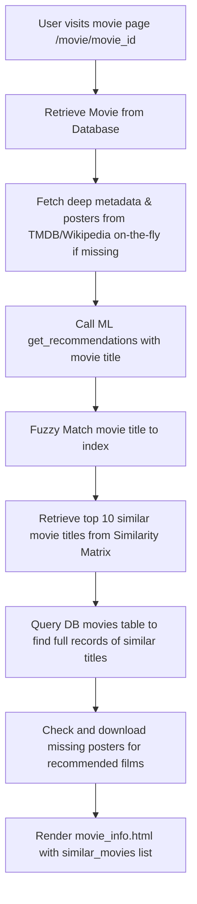

# Cinema-Scale: Project Walkthrough & Architecture

Welcome to **Cinema-Scale**, a web application designed to browse movies, review them, save them to custom lists, and receive intelligent recommendations based on content similarity.

This document provides a comprehensive walkthrough of the project, detailing the overall codebase structure, the math and implementation behind the recommendation engine, and how these systems are integrated to deliver a responsive user interface.

---

## 1. Project Directory Structure

Here is an overview of the key directories and files within the Cinema-Scale project:

```
Cinema-Scale/
├── app.py                      # Flask Application Entrypoint
├── movies.csv                  # The source movie dataset containing metadata
├── requirements.txt            # Project dependencies and libraries
├── populate_posters.py         # Script to pre-populate and seed poster paths
├── Movie_Recommendation_system.ipynb  # Jupyter notebook for ML experimentation
├── models/                     # SQLAlchemy Database Models
│   ├── __init__.py
│   ├── database.py             # SQLAlchemy instance initialization
│   ├── user.py                 # User model (auth & roles)
│   ├── movie.py                # Movie model (deep metadata & cache)
│   ├── like.py                 # Likes join table
│   ├── review.py               # User ratings and comments
│   └── saved_movie.py          # Saved movies/watchlist
├── routes/                     # Blueprint routes
│   ├── __init__.py             # Route registration helper
│   ├── auth.py                 # Sign-up, Login, and Logout
│   ├── main.py                 # Landing page, details page, category pages, profile
│   ├── interactions.py         # Likes, review submission, saving movies
│   ├── admin.py                # Admin dashboard and delete controls
│   └── api.py                  # AJAX paginated movie loader API
├── services/                   # Machine learning core logic
│   ├── __init__.py
│   └── recommendation.py       # TF-IDF & Cosine Similarity ML engine
└── helpers/                    # Utility scripts
    ├── __init__.py
    ├── seeding.py              # Seeds database from CSV records
    └── posters.py              # TMDB/Wikipedia API poster scrapers
```

---

## 2. Core Components & Flow

### A. Initialization & Setup ([app.py](file:///c:/Users/nikhi/OneDrive/Desktop/Group%20Pro/Cinema-Scale/app.py))
When the Flask server starts, the following operations run sequentially:
1. **Database Setup**: The app dynamically determines whether to use a local SQLite database (`movie_app.db`) or connect to a remote PostgreSQL server.
2. **Model Training**: It calls `load_and_train_model("movies.csv")` from [services/recommendation.py](file:///c:/Users/nikhi/OneDrive/Desktop/Group%20Pro/Cinema-Scale/services/recommendation.py). This processes the movie dataset, vectorizes features, and builds a **Cosine Similarity Matrix** in-memory.
3. **Database Seeding**: The server runs `seed_database_from_csv(app)`. If the database tables are empty, it loads base film data from `movies.csv` and populates the database in chunks.
4. **Context Processors**: Injects session data (`current_user`, `is_logged_in`, and `is_admin`) so every page's navbar can adapt dynamically.
5. **Blueprints**: Registers routes for user management, interactions, the recommendation API, and front-end template rendering.

---

## 3. How the Recommendation System Works

The recommendation system utilizes **Content-Based Filtering**. It suggests movies that are metadata-similar to a target movie using Natural Language Processing (NLP) techniques.

The core implementation resides in [services/recommendation.py](file:///c:/Users/nikhi/OneDrive/Desktop/Group%20Pro/Cinema-Scale/services/recommendation.py).

### Step 1: Feature Engineering
We combine the most descriptive text attributes of each movie into a single metadata document. The attributes selected are:
- `genres`: e.g., *Action, Adventure, Science Fiction*
- `keywords`: e.g., *space travel, artificial intelligence, robot*
- `tagline`: e.g., *The adventure of a lifetime.*
- `cast`: e.g., *Matthew McConaughey, Anne Hathaway, Jessica Chastain*
- `director`: e.g., *Christopher Nolan*

```python
combined_features = (
    movies_data['genres'] + ' ' + 
    movies_data['keywords'] + ' ' + 
    movies_data['tagline'] + ' ' + 
    movies_data['cast'] + ' ' + 
    movies_data['director']
)
```

### Step 2: TF-IDF Vectorization
The combined textual metadata of all movies is converted into a numerical matrix using **TF-IDF (Term Frequency-Inverse Document Frequency)**:
$$\text{TF-IDF}(t, d, D) = \text{TF}(t, d) \times \text{IDF}(t, D)$$

- **Term Frequency (TF)**: Measures how often a keyword appears in a single movie's metadata.
- **Inverse Document Frequency (IDF)**: Penalizes words that occur in many movies (like "the", "movie", "action") and boosts rare, descriptive terms (like "cyberpunk", "inception", "time-travel").

The resulting TF-IDF feature matrix represents each movie as a vector in high-dimensional word space.

### Step 3: Cosine Similarity
To measure how "similar" two movies are, we compute the cosine of the angle between their respective TF-IDF vectors.
$$\text{Similarity}(\mathbf{A}, \mathbf{B}) = \frac{\mathbf{A} \cdot \mathbf{B}}{\|\mathbf{A}\| \|\mathbf{B}\|}$$

Using `cosine_similarity(feature_vectors)`, we generate an $N \times N$ matrix (where $N$ is the number of movies). Cell $(i, j)$ contains the similarity score between movie $i$ and movie $j$, ranging from `0` (orthogonal, no overlapping words) to `1` (identical vectors).

### Step 4: Robust Typo Matching & Retrieval
When fetching recommendations for a user query:
1. **Fuzzy Search**: `difflib.get_close_matches` identifies the closest matching movie title in the dataset. This ensures that minor typos (e.g., "Interstelar" instead of "Interstellar") do not crash the system.
2. **Index Lookup**: The system grabs the row index for the matched film.
3. **Sorting Similarity Scores**: It retrieves that film's similarity score row from the precomputed matrix, associates each score with its corresponding movie index, and sorts them in descending order.
4. **Filtering**: The film itself is removed from the list (similarity score `1.0`), and the top $N$ closest movies are returned.

---

## 4. Website Implementation & Integration

The recommendation engine is seamlessly woven into the web application.



### Integration Details

#### 1. In-Memory ML Lifecycle (Eager Initialization)
Computing the TF-IDF matrix and Cosine Similarity is computationally expensive and slow for real-time requests. To solve this, the matrix is computed **once** at server boot in [app.py](file:///c:/Users/nikhi/OneDrive/Desktop/Group%20Pro/Cinema-Scale/app.py):
```python
movies_df, similarity_matrix, list_of_all_titles = load_and_train_model("movies.csv")
```
These parameters are kept in memory and passed into the blueprints via `register_routes(app, movies_df, similarity_matrix, list_of_all_titles)`.

#### 2. The Movie Detail Endpoint ([routes/main.py](file:///c:/Users/nikhi/OneDrive/Desktop/Group%20Pro/Cinema-Scale/routes/main.py))
When a user requests a movie's details page `/movie/<int:movie_id>`:
1. **Retrieve Movie Details**: The route fetches the movie record from the database.
2. **Query ML Model**: It requests the top 10 recommendations:
   ```python
   raw_recommendations = get_recommendations(movie.title, movies_df, similarity_matrix, list_of_all_titles, top_n=10)
   ```
3. **Database Mapping**: The system maps the returned titles back to their SQL database representations:
   ```python
   similar_movies = []
   for rec in raw_recommendations:
       db_movie = Movie.query.filter_by(title=rec['title']).first()
       if db_movie:
           ensure_poster(db_movie)
           similar_movies.append(db_movie)
   ```
4. **On-Demand Poster Enrichment**: Each recommended movie calls `ensure_poster()`, which fetches a poster image URL on the fly (via TMDB or Wikipedia API) if it isn't already cached.
5. **Template Rendering**: The list is sent to the frontend template [templates/movie_info.html](file:///c:/Users/nikhi/OneDrive/Desktop/Group%20Pro/Cinema-Scale/templates/movie_info.html).

#### 3. Frontend UI Presentation
The "Similar Movies" section renders a dynamic carousel or grid of recommended films. Hovering over a card triggers sleek glassmorphism animations, showing the film's genres, year, and rating. Selecting a recommended card navigates the user to that film's detail page, restarting the recommendation cycle.

---

## 5. Other Key Project Features

### A. Live Metadata & Poster Scraper ([helpers/posters.py](file:///c:/Users/nikhi/OneDrive/Desktop/Group%20Pro/Cinema-Scale/helpers/posters.py))
To prevent the local database size from bloat, movie posters and deep metadata (budget, runtime, spoken languages, and revenue) are fetched **on-demand**:
- **TMDB API Scraper**: Queries TMDB by movie title or TMDB ID. Returns deep metrics, overview, runtime, budget, revenue, and high-quality TMDB CDN poster links.
- **Wikipedia API Scraper (Fallback)**: If TMDB fails or faces rate limits, the system falls back to a Wikipedia query for `"{title} film"`. It uses Wikipedia's Media API to locate the main poster file and fetches its direct upload URL from the Wikimedia CDN.

### B. User Reviews & Ratings ([routes/interactions.py](file:///c:/Users/nikhi/OneDrive/Desktop/Group%20Pro/Cinema-Scale/routes/interactions.py))
- Logged-in users can write text reviews and rate movies on a scale of 1–10.
- Average ratings are dynamically updated.
- Users can toggle movie "likes" and "saves" to compile a customized watchlist displayed on their profile page.

### C. Admin Control Panel ([routes/admin.py](file:///c:/Users/nikhi/OneDrive/Desktop/Group%20Pro/Cinema-Scale/routes/admin.py))
- Administrators have access to an `/admin` route.
- Admins can add new movies manually via a web form.
- Admins can inspect the system-wide numbers (users, movies, reviews) and delete violating reviews, movies, or user accounts.
